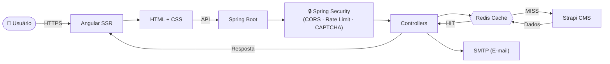

<div align="right">

[🇺🇸 English](#english-version) • [🇧🇷 Português](#portuguese-version)

</div>

<a id="english-version"></a>

<div align="center">


# 🚀 Digital Xis

> A full-stack digital marketing web platform built for performance, SEO, and modern user experience — powered by Angular SSR, Spring Boot, and Strapi CMS.

[📖 About](#about) • [🔄 Flow](#project-flow) • [🛠️ Tech Stack](#tech-stack) • [⚙️ Setup](#setup) • [🚀 Run](#how-to-run) • [🧪 Tests](#tests) • [📡 API](#api-routes) • [🗂️ Structure](#project-structure) • [🚢 Deploy](#deploy) • [⚠️ Issues](#known-issues)

</div>

---

## 📖 About <a id="about"></a>

**Digital Xis** is a dynamic, server-side rendered (SSR) landing page focused on the digital marketing domain. It is designed to deliver high performance, strong online presence, SEO optimization, and a secure, scalable architecture. The platform is divided into three independent, production-ready layers:

| Layer | Technology | Purpose |
| :---: | :---: | :--- |
| Front-end | Angular 21 + SSR | Server-side rendered SPA with smooth UX and SEO |
| Back-end | Spring Boot 4 + Java 21 | REST API with security, rate limiting, caching, and email |
| CMS | Strapi 5 | Headless content management for dynamic page sections |

The architecture follows a **headless CMS pattern**: all page content (carousel, about, reviews, FAQ, business info) is managed in Strapi, served through the Spring Boot API (which acts as a secure proxy and cache layer), and rendered by the Angular SSR front-end.

Key capabilities:
- **Angular SSR** — server-side rendering for fast first paint and crawlable HTML
- **Redis caching** — API responses are cached to minimize Strapi round-trips
- **Bucket4j rate limiting** — protects all endpoints from abuse and DDoS
- **Cloudflare Turnstile** — bot-protection captcha on the contact form
- **Spring Security** — headers hardening, CORS policy, session security
- **Jsoup sanitization** — all user inputs are sanitized before processing

---

## 🔄 Project Flow <a id="project-flow"></a>


---

## 🛠️ Tech Stack <a id="tech-stack"></a>

### Front-end

| Technology | :---: | Purpose |
| :--- | :---: | :--- |
| [Angular 21 🔗](https://angular.dev) | `21.0.0` | SPA framework with component architecture |
| [Angular SSR 🔗](https://angular.dev/guide/ssr) | `21.0.4` | Server-side rendering via Express |
| [Express 🔗](https://expressjs.com) | `5.1.0` | Node.js HTTP server for SSR |
| [Lenis 🔗](https://lenis.darkroom.engineering) | `1.3.18` | Native smooth scroll library |
| [RxJS 🔗](https://rxjs.dev) | `7.8.0` | Reactive programming for HTTP streams |
| [TypeScript 🔗](https://www.typescriptlang.org) | `5.9.2` | Strictly typed JavaScript |
| [Vitest 🔗](https://vitest.dev) | `4.0.8` | Unit testing framework |

### Back-end

| Technology | Version | Purpose |
| :--- | :---: | :--- |
| [Java 🔗](https://adoptium.net) | `21 LTS` | Platform language (LTS) |
| [Spring Boot 🔗](https://spring.io/projects/spring-boot) | `4.0.4` | Application framework |
| [Spring WebMVC 🔗](https://docs.spring.io/spring-framework/reference/web/webmvc.html) | `4.0.4` | REST controllers and servlet layer |
| [Spring Security 🔗](https://spring.io/projects/spring-security) | `4.0.4` | CORS, headers hardening, session security |
| [Spring Mail 🔗](https://docs.spring.io/spring-framework/reference/integration/email.html) | `4.0.4` | Email delivery via SMTP |
| [Spring Data Redis 🔗](https://spring.io/projects/spring-data-redis) | `4.0.4` | Reactive Redis cache integration |
| [Spring WebClient 🔗](https://docs.spring.io/spring-framework/reference/web/webflux-webclient.html) | `4.0.4` | Non-blocking HTTP client for CMS calls |
| [Bucket4j 🔗](https://github.com/bucket4j/bucket4j) | `8.5.0` | Token-bucket rate limiting |
| [Lombok 🔗](https://projectlombok.org) | (managed) | Boilerplate reduction annotations |
| [MapStruct 🔗](https://mapstruct.org) | `1.6.3` | DTO ↔ domain object mapping |
| [Jsoup 🔗](https://jsoup.org) | `1.17.2` | HTML sanitization for user inputs |
| [Springdoc OpenAPI 🔗](https://springdoc.org) | `3.0.2` | Swagger / OpenAPI documentation |
| [Maven 🔗](https://maven.apache.org) | `3.9.14` | Dependency management and build |

### CMS

| Technology | Version | Purpose |
| :--- | :---: | :--- |
| [Strapi 🔗](https://strapi.io) | `5.36.1` | Headless CMS with REST API |
| [better-sqlite3 🔗](https://github.com/WiseLibs/better-sqlite3) | `12.4.1` | Embedded SQLite database driver |
| [Node.js 🔗](https://nodejs.org) | `≥ 20` | CMS runtime |

### Infrastructure

| Technology | Version | Purpose |
| :--- | :---: | :--- |
| [Docker 🔗](https://www.docker.com) | Latest | Container build and orchestration |
| [Redis 🔗](https://redis.io) | `7` | In-memory API response cache |
| [Vercel 🔗](https://vercel.com) | — | Front-end SSR deployment platform |

---

## 📦 Dependencies <a id="dependencies"></a>

### Front-end (`front-end/package.json`)

| Package | Version | Link |
| :--- | :---: | :---: |
| `@angular/core` | `^21.0.0` | [🔗](https://www.npmjs.com/package/@angular/core) |
| `@angular/ssr` | `^21.0.4` | [🔗](https://www.npmjs.com/package/@angular/ssr) |
| `express` | `^5.1.0` | [🔗](https://www.npmjs.com/package/express) |
| `lenis` | `^1.3.18` | [🔗](https://www.npmjs.com/package/lenis) |
| `rxjs` | `~7.8.0` | [🔗](https://www.npmjs.com/package/rxjs) |
| `vitest` | `^4.0.8` | [🔗](https://www.npmjs.com/package/vitest) |

### Back-end (`back-end/pom.xml`)

| Artifact | Version | Link |
| :--- | :---: | :---: |
| `spring-boot-starter-webmvc` | `4.0.4` | [🔗](https://mvnrepository.com/artifact/org.springframework.boot/spring-boot-starter-webmvc) |
| `spring-boot-starter-security` | `4.0.4` | [🔗](https://mvnrepository.com/artifact/org.springframework.boot/spring-boot-starter-security) |
| `spring-boot-starter-data-redis-reactive` | `4.0.4` | [🔗](https://mvnrepository.com/artifact/org.springframework.boot/spring-boot-starter-data-redis-reactive) |
| `spring-boot-starter-mail` | `4.0.4` | [🔗](https://mvnrepository.com/artifact/org.springframework.boot/spring-boot-starter-mail) |
| `bucket4j-core` | `8.5.0` | [🔗](https://mvnrepository.com/artifact/com.bucket4j/bucket4j-core) |
| `mapstruct` | `1.6.3` | [🔗](https://mvnrepository.com/artifact/org.mapstruct/mapstruct) |
| `jsoup` | `1.17.2` | [🔗](https://mvnrepository.com/artifact/org.jsoup/jsoup) |
| `springdoc-openapi-starter-webmvc-ui` | `3.0.2` | [🔗](https://mvnrepository.com/artifact/org.springdoc/springdoc-openapi-starter-webmvc-ui) |

---

## ✅ Prerequisites <a id="prerequisites"></a>

| Tool | Version | Link |
| :---: | :---: | :---: |
| [Node.js 🔗](https://nodejs.org) | `≥ 20.x` | Required for front-end and CMS |
| [npm 🔗](https://www.npmjs.com) | `≥ 6.x` | Package manager |
| [Java JDK 🔗](https://adoptium.net/temurin/releases/?version=21) | `21 LTS` | Required for back-end |
| [Maven 🔗](https://maven.apache.org/download.cgi) | `≥ 3.9` | Build tool (or use `./mvnw`) |
| [Docker 🔗](https://www.docker.com/products/docker-desktop) | Latest | Container runtime |
| [Redis 🔗](https://redis.io/docs/getting-started) | `≥ 7` | Cache (or run via Docker Compose) |

---

## ⚙️ Environment Setup <a id="setup"></a>

### Back-end (`back-end/`)

Create an `.env` file or export the following variables before running:

```bash
MAIL_PORT=587
MAIL_USER=your-gmail@gmail.com
MAIL_PASS=your-gmail-app-password

CMS_HOST=http://localhost:1337

CAPTCHA_SECRET_KEY=your-cloudflare-turnstile-secret

CACHE_HOST=localhost
CACHE_PORT=6379
```

### CMS (`cms-strapi/`)

Copy the example file and fill in the secrets:

```bash
cp cms-strapi/.env.example cms-strapi/.env
```

```env
HOST=0.0.0.0
PORT=1337
APP_KEYS="key1,key2"
API_TOKEN_SALT=your-salt
ADMIN_JWT_SECRET=your-admin-secret
TRANSFER_TOKEN_SALT=your-transfer-salt
JWT_SECRET=your-jwt-secret
ENCRYPTION_KEY=your-encryption-key
```

---

## 🚀 How to Run <a id="how-to-run"></a>

### 1. Clone the repository

```bash
git clone https://github.com/marcGarcias/digital-xis.git
cd digital-xis
```

### 2. Start the CMS (Strapi)

```bash
cd cms-strapi
npm install
npm run dev
# CMS Admin → http://localhost:1337/admin
```

### 3. Start Redis (via Docker Compose)

```bash
cd back-end
docker compose up redis -d
```

### 4. Start the Back-end

```bash
cd back-end
./mvnw spring-boot:run
# API → http://localhost:8080
```

### 5. Start the Front-end

```bash
cd front-end
npm install
npm start
# App → http://localhost:4200
```

### Run with Docker (Back-end + Redis)

```bash
cd back-end
docker compose up --build
```

### Build the Front-end SSR image

```bash
cd front-end
docker build -t digital-xis-frontend .
docker run -p 4200:4200 digital-xis-frontend
```

---

## 🧪 Tests <a id="tests"></a>

### Front-end (Vitest)

```bash
cd front-end
npm test
```

<details>
<summary>📋 Expected output</summary>

```
 ✓ src/app/app.spec.ts (1 test)
   ✓ AppComponent should create the app

Test Files  1 passed
Tests       1 passed
Duration    ~1.2s
```

</details>

### Back-end (JUnit + Spring Boot Test)

```bash
cd back-end
./mvnw test
```

<details>
<summary>📋 Expected output</summary>

```
[INFO] Tests run: X, Failures: 0, Errors: 0, Skipped: 0
[INFO] BUILD SUCCESS
```

</details>

---

## 📡 API Routes <a id="api-routes"></a>

Base URL: `http://localhost:8080`

### CMS Content

| Method | Route | Description |
| :---: | :--- | :--- |
| `GET` | `/api/content/carousel` | Returns carousel items for the homepage |
| `GET` | `/api/content/about` | Returns the "About Us" section content |
| `GET` | `/api/content/review` | Returns customer reviews and testimonials |
| `GET` | `/api/content/faq` | Returns the frequently asked questions list |
| `GET` | `/api/content/info` | Returns general business information |

### Contact

| Method | Route | Description |
| :---: | :--- | :--- |
| `POST` | `/api/contact` | Submits a contact form message via email |

### Proxy

| Method | Route | Description |
| :---: | :--- | :--- |
| `GET` | `/uploads/**` | Proxies static assets (images) from Strapi CMS |

---

<details>
<summary>📨 POST /api/contact — Example Request & Response</summary>

**Request:**
```json
POST /api/contact
Content-Type: application/json

{
  "name": "João Silva",
  "email": "joao@example.com",
  "subject": "Budget request",
  "message": "I'd like to get a quote for a landing page.",
  "turnstileToken": "CLOUDFLARE_TURNSTILE_TOKEN"
}
```

**Response `200 OK`:**
```json
{
  "success": true,
  "message": "Message sent successfully."
}
```

**Response `400 Bad Request`:**
```json
{
  "error": "Invalid or expired security verification"
}
```

</details>

<details>
<summary>📦 GET /api/content/carousel — Example Response</summary>

**Response `200 OK`:**
```json
{
  "data": [
    {
      "id": 1,
      "title": "Digital Marketing that Converts",
      "subtitle": "Accelerate your brand's online presence",
      "imageUrl": "/uploads/banner_1.webp"
    }
  ]
}
```

**Response `502 Bad Gateway`:**
```json
{
  "status": 502,
  "error": "Error communicating with CMS",
  "path": "/api/content/carousel"
}
```

</details>

---

## 🗂️ Project Structure <a id="project-structure"></a>

```
digital-xis/
├── front-end/                    # Angular 21 SSR application
│   ├── src/
│   │   ├── app/
│   │   │   ├── components/       # Shared UI components (logo, nav, footer)
│   │   │   ├── pages/            # Route-based page components
│   │   │   │   ├── home/         # Homepage
│   │   │   │   └── privacy-policy/
│   │   │   ├── models/           # TypeScript interfaces for API data
│   │   │   ├── services/         # HTTP services (CMS, contact)
│   │   │   ├── app.routes.ts     # Routing config
│   │   │   └── app.config.ts     # App providers and HTTP client
│   │   ├── styles/               # Global CSS styles
│   │   ├── server.ts             # Express SSR server entry
│   │   └── index.html            # Root HTML template (SEO meta tags)
│   ├── Dockerfile                # Multi-stage Docker build (Node 22 Alpine)
│   └── vercel.json               # Vercel deployment config
│
├── back-end/                     # Spring Boot 4 REST API
│   ├── src/main/java/dev/garcias/backend/
│   │   ├── config/
│   │   │   ├── SecurityConfig.java      # CORS, security headers, session
│   │   │   └── RateLimitFilter.java     # Bucket4j rate limiting filter
│   │   ├── controller/
│   │   │   ├── CMSController.java       # Content endpoints
│   │   │   ├── ContactController.java   # Contact form endpoint
│   │   │   └── ProxyController.java     # CMS media proxy
│   │   ├── service/                     # Business logic layer
│   │   ├── dto/                         # Request and response DTOs
│   │   ├── mapper/                      # MapStruct mappers
│   │   └── exception/                   # Global error handling
│   ├── src/main/resources/
│   │   └── application.properties       # App config and env references
│   ├── dockerfile                        # Multi-stage Docker build (Maven + JRE Alpine)
│   └── docker-compose.yml               # Redis + API services
│
└── cms-strapi/                   # Strapi 5 headless CMS
    ├── config/                   # Server, database, middlewares, plugins config
    ├── src/                      # Custom content types and extensions
    ├── database/                 # SQLite data and migrations
    ├── .env.example              # Environment variables template
    └── package.json
```

---

## 🚢 Deploy <a id="deploy"></a>

### Front-end → [Vercel 🔗](https://vercel.com)

The front-end deploys to Vercel as a containerized SSR application.

```bash
# Build for production
cd front-end
npm run build

# SSR server output
node dist/front-end/server/server.mjs
```

| Artifact | Path | Notes |
| :---: | :--- | :--- |
| Browser bundle | `dist/front-end/browser/` | Static assets |
| SSR server | `dist/front-end/server/server.mjs` | Node.js server |

The `vercel.json` file at the root of `front-end/` configures Vercel routing automatically.

### Back-end → Docker

```bash
cd back-end

# Build image
docker build -t digital-xis-backend .

# Run with environment variables
docker run -p 8080:8080 \
  -e MAIL_PORT=587 \
  -e MAIL_USER=your@gmail.com \
  -e MAIL_PASS=your-app-password \
  -e CMS_HOST=http://your-strapi-host:1337 \
  -e CAPTCHA_SECRET_KEY=your-key \
  -e CACHE_HOST=redis \
  -e CACHE_PORT=6379 \
  digital-xis-backend
```

### CMS → [Strapi Cloud 🔗](https://cloud.strapi.io)

The CMS is deployable to Strapi Cloud using the built-in `@strapi/plugin-cloud` plugin:

```bash
cd cms-strapi
npm run deploy
```

---

## ⚠️ Known Issues <a id="known-issues"></a>

<details>
<summary>🐛 Redis connection required on back-end startup</summary>

The Spring Boot API requires a running Redis instance at startup. If Redis is unavailable, the application will fail to start. Always ensure the Redis container is up before starting the API.

**Workaround:** Use `docker compose up redis -d` before running the back-end.

</details>

## 🔮 Next Steps

- [ ] Configure CI/CD pipeline with GitHub Actions for automated deployments


---

## 📄 License

This project is licensed under the [PolyForm Noncommercial License 🔗](https://polyformproject.org/licenses/noncommercial/1.0.0).

---

<div align="center">made with lots of coffee — leave a ⭐ if this project helped you!</div>

---

<a id="portuguese-version"></a>

<div align="center">


# 🚀 Digital Xis

> Plataforma web de marketing digital full-stack construída para performance, SEO e experiência de usuário moderna — com Angular SSR, Spring Boot e Strapi CMS.

[📖 Sobre](#sobre) • [🔄 Fluxo](#fluxo-do-projeto) • [🛠️ Tecnologias](#tecnologias) • [⚙️ Configuração](#configuracao) • [🚀 Executar](#como-executar) • [🧪 Testes](#testes) • [📡 API](#rotas-da-api) • [🗂️ Estrutura](#estrutura-do-projeto) • [🚢 Deploy](#deploy-pt) • [⚠️ Problemas](#problemas-conhecidos)

</div>

---

## 📖 Sobre <a id="sobre"></a>

A **Digital Xis** é uma landing page com renderização no servidor (SSR) e conteúdo dinâmico, voltada ao segmento de marketing digital. Foi projetada para garantir alta performance, forte presença online, otimização para SEO e uma arquitetura segura e escalável. A plataforma é dividida em três camadas independentes e prontas para produção:

| Camada | Tecnologia | Finalidade |
| :---: | :---: | :--- |
| Front-end | Angular 21 + SSR | SPA com renderização no servidor, UX fluida e SEO |
| Back-end | Spring Boot 4 + Java 21 | API REST com segurança, rate limiting, cache e e-mail |
| CMS | Strapi 5 | Gerenciamento headless do conteúdo das páginas |

A arquitetura segue o padrão **headless CMS**: todo o conteúdo das páginas (carrossel, sobre, avaliações, FAQ, informações do negócio) é gerenciado no Strapi, servido via Spring Boot API (que atua como proxy seguro e camada de cache), e renderizado pelo front-end Angular SSR.

Principais capacidades:
- **Angular SSR** — renderização no servidor para primeiro carregamento rápido e HTML rastreável por bots
- **Cache Redis** — respostas da API são cacheadas para minimizar chamadas ao Strapi
- **Rate limiting com Bucket4j** — proteção de todos os endpoints contra abuso e DDoS
- **Cloudflare Turnstile** — captcha anti-bot no formulário de contato
- **Spring Security** — endurecimento de headers HTTP, política de CORS, segurança de sessão
- **Sanitização Jsoup** — todos os inputs do usuário são sanitizados antes de serem processados

---

## 🔄 Fluxo do Projeto <a id="fluxo-do-projeto"></a>



---

## 🛠️ Tecnologias <a id="tecnologias"></a>

### Front-end

| Tecnologia | Versão | Finalidade |
| :--- | :---: | :--- |
| [Angular 21 🔗](https://angular.dev) | `21.0.0` | Framework SPA com arquitetura de componentes |
| [Angular SSR 🔗](https://angular.dev/guide/ssr) | `21.0.4` | Renderização no servidor via Express |
| [Express 🔗](https://expressjs.com) | `5.1.0` | Servidor HTTP Node.js para SSR |
| [Lenis 🔗](https://lenis.darkroom.engineering) | `1.3.18` | Biblioteca de scroll suave nativo |
| [RxJS 🔗](https://rxjs.dev) | `7.8.0` | Programação reativa para streams HTTP |
| [TypeScript 🔗](https://www.typescriptlang.org) | `5.9.2` | JavaScript com tipagem estrita |
| [Vitest 🔗](https://vitest.dev) | `4.0.8` | Framework de testes unitários |

### Back-end

| Tecnologia | Versão | Finalidade |
| :--- | :---: | :--- |
| [Java 🔗](https://adoptium.net) | `21 LTS` | Linguagem principal da plataforma (LTS) |
| [Spring Boot 🔗](https://spring.io/projects/spring-boot) | `4.0.4` | Framework de aplicação |
| [Spring WebMVC 🔗](https://docs.spring.io/spring-framework/reference/web/webmvc.html) | `4.0.4` | Controllers REST e camada servlet |
| [Spring Security 🔗](https://spring.io/projects/spring-security) | `4.0.4` | CORS, headers de segurança, sessão |
| [Spring Mail 🔗](https://docs.spring.io/spring-framework/reference/integration/email.html) | `4.0.4` | Envio de e-mails via SMTP |
| [Spring Data Redis 🔗](https://spring.io/projects/spring-data-redis) | `4.0.4` | Integração reativa com Redis |
| [Spring WebClient 🔗](https://docs.spring.io/spring-framework/reference/web/webflux-webclient.html) | `4.0.4` | Client HTTP não-bloqueante para o CMS |
| [Bucket4j 🔗](https://github.com/bucket4j/bucket4j) | `8.5.0` | Rate limiting com algoritmo token-bucket |
| [Lombok 🔗](https://projectlombok.org) | (gerenciado) | Redução de código boilerplate |
| [MapStruct 🔗](https://mapstruct.org) | `1.6.3` | Mapeamento DTO ↔ objetos de domínio |
| [Jsoup 🔗](https://jsoup.org) | `1.17.2` | Sanitização de HTML nos inputs do usuário |
| [Springdoc OpenAPI 🔗](https://springdoc.org) | `3.0.2` | Documentação Swagger / OpenAPI |
| [Maven 🔗](https://maven.apache.org) | `3.9.14` | Gerenciamento de dependências e build |

### CMS

| Tecnologia | Versão | Finalidade |
| :--- | :---: | :--- |
| [Strapi 🔗](https://strapi.io) | `5.36.1` | CMS headless com API REST |
| [better-sqlite3 🔗](https://github.com/WiseLibs/better-sqlite3) | `12.4.1` | Driver SQLite embarcado |
| [Node.js 🔗](https://nodejs.org) | `≥ 20` | Runtime do CMS |

### Infraestrutura

| Tecnologia | Versão | Finalidade |
| :--- | :---: | :--- |
| [Docker 🔗](https://www.docker.com) | Mais recente | Build e orquestração de containers |
| [Redis 🔗](https://redis.io) | `7` | Cache em memória para respostas da API |
| [Vercel 🔗](https://vercel.com) | — | Plataforma de deploy do front-end SSR |

---

## 📦 Dependências <a id="dependencias"></a>

### Front-end (`front-end/package.json`)

| Pacote | Versão | Link |
| :--- | :---: | :---: |
| `@angular/core` | `^21.0.0` | [🔗](https://www.npmjs.com/package/@angular/core) |
| `@angular/ssr` | `^21.0.4` | [🔗](https://www.npmjs.com/package/@angular/ssr) |
| `express` | `^5.1.0` | [🔗](https://www.npmjs.com/package/express) |
| `lenis` | `^1.3.18` | [🔗](https://www.npmjs.com/package/lenis) |
| `rxjs` | `~7.8.0` | [🔗](https://www.npmjs.com/package/rxjs) |
| `vitest` | `^4.0.8` | [🔗](https://www.npmjs.com/package/vitest) |

### Back-end (`back-end/pom.xml`)

| Artefato | Versão | Link |
| :--- | :---: | :---: |
| `spring-boot-starter-webmvc` | `4.0.4` | [🔗](https://mvnrepository.com/artifact/org.springframework.boot/spring-boot-starter-webmvc) |
| `spring-boot-starter-security` | `4.0.4` | [🔗](https://mvnrepository.com/artifact/org.springframework.boot/spring-boot-starter-security) |
| `spring-boot-starter-data-redis-reactive` | `4.0.4` | [🔗](https://mvnrepository.com/artifact/org.springframework.boot/spring-boot-starter-data-redis-reactive) |
| `spring-boot-starter-mail` | `4.0.4` | [🔗](https://mvnrepository.com/artifact/org.springframework.boot/spring-boot-starter-mail) |
| `bucket4j-core` | `8.5.0` | [🔗](https://mvnrepository.com/artifact/com.bucket4j/bucket4j-core) |
| `mapstruct` | `1.6.3` | [🔗](https://mvnrepository.com/artifact/org.mapstruct/mapstruct) |
| `jsoup` | `1.17.2` | [🔗](https://mvnrepository.com/artifact/org.jsoup/jsoup) |
| `springdoc-openapi-starter-webmvc-ui` | `3.0.2` | [🔗](https://mvnrepository.com/artifact/org.springdoc/springdoc-openapi-starter-webmvc-ui) |

---

## ✅ Pré-requisitos <a id="pre-requisitos"></a>

| Ferramenta | Versão | Link |
| :---: | :---: | :---: |
| [Node.js 🔗](https://nodejs.org) | `≥ 20.x` | Necessário para o front-end e CMS |
| [npm 🔗](https://www.npmjs.com) | `≥ 6.x` | Gerenciador de pacotes |
| [Java JDK 🔗](https://adoptium.net/temurin/releases/?version=21) | `21 LTS` | Necessário para o back-end |
| [Maven 🔗](https://maven.apache.org/download.cgi) | `≥ 3.9` | Ferramenta de build (ou use `./mvnw`) |
| [Docker 🔗](https://www.docker.com/products/docker-desktop) | Mais recente | Runtime de containers |
| [Redis 🔗](https://redis.io/docs/getting-started) | `≥ 7` | Cache (ou use via Docker Compose) |

---

## ⚙️ Configuração do Ambiente <a id="configuracao"></a>

### Back-end (`back-end/`)

Crie um arquivo `.env` ou exporte as seguintes variáveis antes de executar:

```bash
MAIL_PORT=587
MAIL_USER=seu-gmail@gmail.com
MAIL_PASS=sua-senha-de-app-gmail

CMS_HOST=http://localhost:1337

CAPTCHA_SECRET_KEY=sua-chave-secreta-cloudflare-turnstile

CACHE_HOST=localhost
CACHE_PORT=6379
```

### CMS (`cms-strapi/`)

Copie o arquivo de exemplo e preencha os segredos:

```bash
cp cms-strapi/.env.example cms-strapi/.env
```

```env
HOST=0.0.0.0
PORT=1337
APP_KEYS="chave1,chave2"
API_TOKEN_SALT=seu-salt
ADMIN_JWT_SECRET=seu-segredo-admin
TRANSFER_TOKEN_SALT=seu-salt-de-transferencia
JWT_SECRET=seu-jwt-secret
ENCRYPTION_KEY=sua-chave-de-criptografia
```

---

## 🚀 Como Executar <a id="como-executar"></a>

### 1. Clone o repositório

```bash
git clone https://github.com/marcGarcias/digital-xis.git
cd digital-xis
```

### 2. Inicie o CMS (Strapi)

```bash
cd cms-strapi
npm install
npm run dev
# Painel Admin → http://localhost:1337/admin
```

### 3. Inicie o Redis (via Docker Compose)

```bash
cd back-end
docker compose up redis -d
```

### 4. Inicie o Back-end

```bash
cd back-end
./mvnw spring-boot:run
# API → http://localhost:8080
```

### 5. Inicie o Front-end

```bash
cd front-end
npm install
npm start
# App → http://localhost:4200
```

### Executar com Docker (Back-end + Redis)

```bash
cd back-end
docker compose up --build
```

### Build da imagem SSR do Front-end

```bash
cd front-end
docker build -t digital-xis-frontend .
docker run -p 4200:4200 digital-xis-frontend
```

---

## 🧪 Testes <a id="testes"></a>

### Front-end (Vitest)

```bash
cd front-end
npm test
```

<details>
<summary>📋 Resultado esperado</summary>

```
 ✓ src/app/app.spec.ts (1 teste)
   ✓ AppComponent deve criar o componente

Arquivos de Teste  1 passou
Testes             1 passou
Duração            ~1.2s
```

</details>

### Back-end (JUnit + Spring Boot Test)

```bash
cd back-end
./mvnw test
```

<details>
<summary>📋 Resultado esperado</summary>

```
[INFO] Tests run: X, Failures: 0, Errors: 0, Skipped: 0
[INFO] BUILD SUCCESS
```

</details>

---

## 📡 Rotas da API <a id="rotas-da-api"></a>

URL base: `http://localhost:8080`

### Conteúdo do CMS

| Método | Rota | Descrição |
| :---: | :--- | :--- |
| `GET` | `/api/content/carousel` | Retorna os itens do carrossel da homepage |
| `GET` | `/api/content/about` | Retorna o conteúdo da seção "Sobre Nós" |
| `GET` | `/api/content/review` | Retorna avaliações e depoimentos de clientes |
| `GET` | `/api/content/faq` | Retorna a lista de perguntas frequentes |
| `GET` | `/api/content/info` | Retorna informações gerais do negócio |

### Contato

| Método | Rota | Descrição |
| :---: | :--- | :--- |
| `POST` | `/api/contact` | Envia uma mensagem do formulário de contato via e-mail |

### Proxy

| Método | Rota | Descrição |
| :---: | :--- | :--- |
| `GET` | `/uploads/**` | Faz proxy de assets estáticos (imagens) do Strapi CMS |

---

<details>
<summary>📨 POST /api/contact — Exemplo de Requisição e Resposta</summary>

**Requisição:**
```json
POST /api/contact
Content-Type: application/json

{
  "name": "João Silva",
  "email": "joao@exemplo.com",
  "subject": "Solicitação de orçamento",
  "message": "Gostaria de obter um orçamento para uma landing page.",
  "turnstileToken": "TOKEN_CLOUDFLARE_TURNSTILE"
}
```

**Resposta `200 OK`:**
```json
{
  "success": true,
  "message": "Message sent successfully."
}
```

**Resposta `400 Bad Request`:**
```json
{
  "error": "Invalid or expired security verification"
}
```

</details>

<details>
<summary>📦 GET /api/content/carousel — Exemplo de Resposta</summary>

**Resposta `200 OK`:**
```json
{
  "data": [
    {
      "id": 1,
      "title": "Marketing Digital que Converte",
      "subtitle": "Acelere a presença online da sua marca",
      "imageUrl": "/uploads/banner_1.webp"
    }
  ]
}
```

**Resposta `502 Bad Gateway`:**
```json
{
  "status": 502,
  "error": "Error communicating with CMS",
  "path": "/api/content/carousel"
}
```

</details>

---

## 🗂️ Estrutura do Projeto <a id="estrutura-do-projeto"></a>

```
digital-xis/
├── front-end/                    # Aplicação Angular 21 com SSR
│   ├── src/
│   │   ├── app/
│   │   │   ├── components/       # Componentes de UI reutilizáveis (logo, nav, rodapé)
│   │   │   ├── pages/            # Componentes de página baseados em rotas
│   │   │   │   ├── home/         # Página inicial
│   │   │   │   └── privacy-policy/
│   │   │   ├── models/           # Interfaces TypeScript para dados da API
│   │   │   ├── services/         # Serviços HTTP (CMS, contato)
│   │   │   ├── app.routes.ts     # Configuração de rotas
│   │   │   └── app.config.ts     # Providers e client HTTP
│   │   ├── styles/               # Estilos CSS globais
│   │   ├── server.ts             # Entry point do servidor Express SSR
│   │   └── index.html            # Template HTML raiz (meta tags SEO)
│   ├── Dockerfile                # Build Docker multi-estágio (Node 22 Alpine)
│   └── vercel.json               # Configuração de deploy na Vercel
│
├── back-end/                     # API REST Spring Boot 4
│   ├── src/main/java/dev/garcias/backend/
│   │   ├── config/
│   │   │   ├── SecurityConfig.java      # CORS, headers de segurança, sessão
│   │   │   └── RateLimitFilter.java     # Filtro de rate limiting com Bucket4j
│   │   ├── controller/
│   │   │   ├── CMSController.java       # Endpoints de conteúdo
│   │   │   ├── ContactController.java   # Endpoint do formulário de contato
│   │   │   └── ProxyController.java     # Proxy para mídias do CMS
│   │   ├── service/                     # Camada de lógica de negócio
│   │   ├── dto/                         # DTOs de requisição e resposta
│   │   ├── mapper/                      # Mappers MapStruct
│   │   └── exception/                   # Tratamento global de erros
│   ├── src/main/resources/
│   │   └── application.properties       # Configuração da app e variáveis de ambiente
│   ├── dockerfile                        # Build Docker multi-estágio (Maven + JRE Alpine)
│   └── docker-compose.yml               # Serviços Redis + API
│
└── cms-strapi/                   # CMS Headless Strapi 5
    ├── config/                   # Configuração de servidor, banco, middlewares e plugins
    ├── src/                      # Tipos de conteúdo customizados e extensões
    ├── database/                 # Dados SQLite e migrações
    ├── .env.example              # Template de variáveis de ambiente
    └── package.json
```

---

## 🚢 Deploy <a id="deploy-pt"></a>

### Front-end → [Vercel 🔗](https://vercel.com)

O front-end é deployado na Vercel como aplicação SSR containerizada.

```bash
# Build para produção
cd front-end
npm run build

# Servidor SSR de saída
node dist/front-end/server/server.mjs
```

| Artefato | Caminho | Observação |
| :---: | :--- | :--- |
| Bundle do browser | `dist/front-end/browser/` | Assets estáticos |
| Servidor SSR | `dist/front-end/server/server.mjs` | Servidor Node.js |

O arquivo `vercel.json` na raiz de `front-end/` configura o roteamento da Vercel automaticamente.

### Back-end → Docker

```bash
cd back-end

# Build da imagem
docker build -t digital-xis-backend .

# Executar com variáveis de ambiente
docker run -p 8080:8080 \
  -e MAIL_PORT=587 \
  -e MAIL_USER=seu@gmail.com \
  -e MAIL_PASS=sua-senha-de-app \
  -e CMS_HOST=http://seu-strapi:1337 \
  -e CAPTCHA_SECRET_KEY=sua-chave \
  -e CACHE_HOST=redis \
  -e CACHE_PORT=6379 \
  digital-xis-backend
```

### CMS → [Strapi Cloud 🔗](https://cloud.strapi.io)

O CMS pode ser deployado no Strapi Cloud usando o plugin `@strapi/plugin-cloud` já incluído:

```bash
cd cms-strapi
npm run deploy
```

---

## ⚠️ Problemas Conhecidos <a id="problemas-conhecidos"></a>

<details>
<summary>🐛 Conexão Redis obrigatória na inicialização do back-end</summary>

A API Spring Boot requer uma instância Redis em execução ao iniciar. Se o Redis estiver indisponível, a aplicação não vai subir. Sempre certifique-se de que o container Redis está ativo antes de iniciar a API.

**Solução:** Use `docker compose up redis -d` antes de executar o back-end.

</details>

---

## 🔮 Próximos Passos

- [ ] Configurar pipeline de CI/CD com GitHub Actions para deploys automatizados

---

## 📄 Licença

Este projeto está licenciado sob a [PolyForm Noncommercial License 🔗](https://polyformproject.org/licenses/noncommercial/1.0.0).

---

<div align="center">Feito com muito ☕ — deixe uma ⭐ se este projeto te ajudou!</div>
